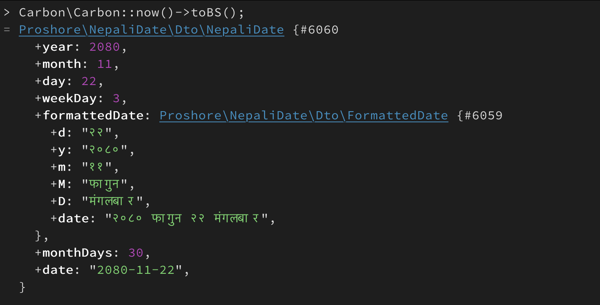
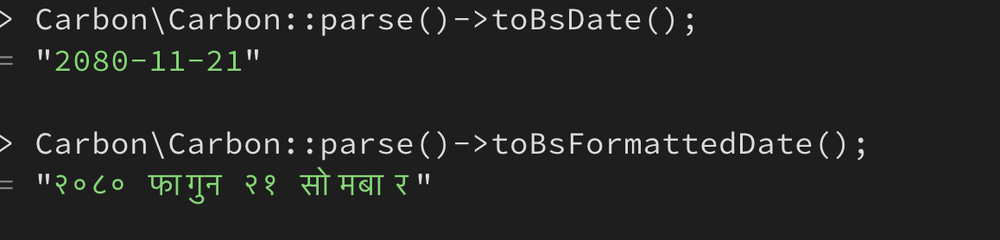
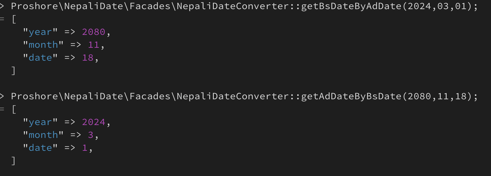
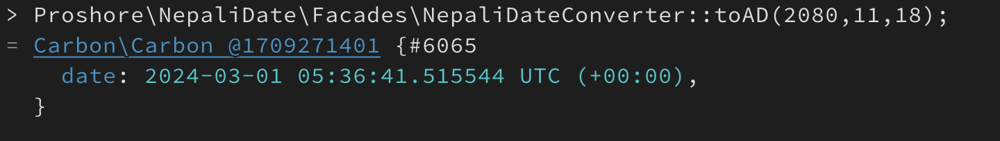

# Laravel Nepali Date Converter

This Laravel package provides functionality to convert dates from the Gregorian calendar (AD) to the Bikram Sambat calendar (BS) using the native Carbon library. It's especially useful for applications targeting Nepali users or systems where Bikram Sambat dates are relevant.

## Features

- Seamless conversion of dates from AD to BS and vice versa.
- Integration with Laravel's native Carbon library for efficient and accurate date manipulation.
- Simple to integrate into existing Laravel applications.

## Requirements

- PHP >= 8.0
- Carbon PHP Library

## Installation

### Composer
Install using composer

`composer require proshore/laravel-nepali-date-converter`

Publish your config file

`php artisan vendor:publish --tag=nepali-date`

## Usages
You can directly convert Carbon date to Nepali date using chain function in Carbon.

``Carbon\Carbon::now()->toBs();``

Get Formatted date

``Carbon\Carbon::now()->toBsDate()``

``Carbon\Carbon::now()->toBsFormattedDate()``

Using without carbon

``Proshore\NepaliDate\Facades\NepaliDateConverter::getBsDateByAdDate(2024,03,01);``

``Proshore\NepaliDate\Facades\NepaliDateConverter::getAdDateByBsDate(2080,11,18);``

Get Carbon date from Bs Date

``Proshore\NepaliDate\Facades\NepaliDateConverter::toAd(2080,11,18);``

